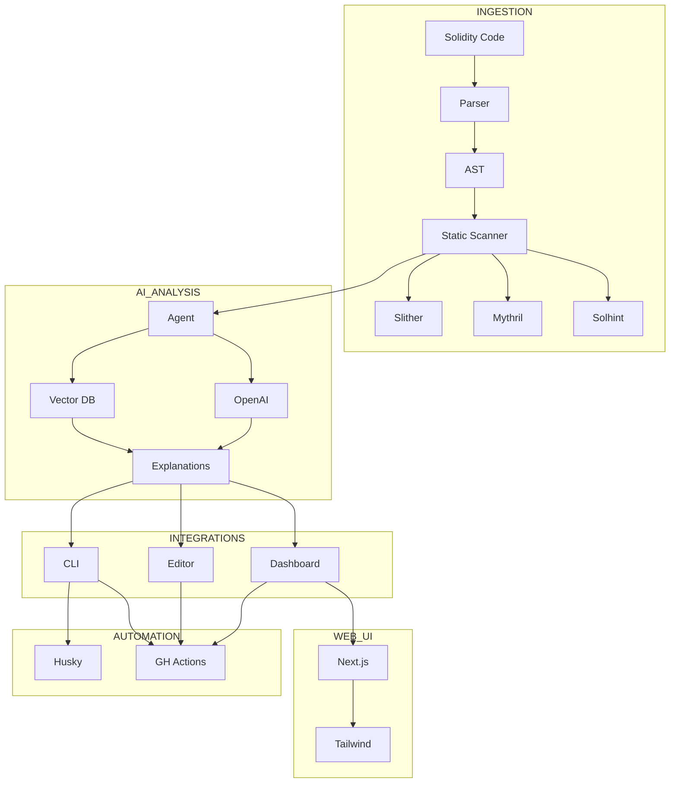

# AI-Powered Smart Contract Audit Assistant

An interactive SpoonOS-powered tool that provides real-time vulnerability checks, natural-language explanations, and hands-on learning for your Solidity contracts—before you deploy.

## Features

- **Real-time Security Analysis**: Instant vulnerability detection using static analysis tools (Slither, Mythril, Solhint)
- **AI-Powered Explanations**: Natural language explanations of vulnerabilities powered by SpoonOS Agent Framework
- **Interactive Learning**: Step-by-step tutorials and remediation guidance
- **Multiple Interfaces**: CLI tool, VS Code extension, and web dashboard
- **CI/CD Integration**: GitHub Actions and Git hooks for automated security checks
- **Watch Mode**: Continuous monitoring of contract changes during development

## Installation

### Prerequisites

- Python 3.10+
- Node.js 16+ (for VS Code extension and web dashboard)
- Git

### Install from PyPI

```bash
pip install spoon-audit
```

### Install from Source

```bash
git clone https://github.com/your-org/smart-audit-assistant.git
cd smart-audit-assistant
pip install -e .
```

## Quick Start

### 1. Configuration

First, configure your API keys and preferences:

```bash
# View current configuration
spoon-audit config --show

# Set OpenAI API key (required for AI explanations)
spoon-audit config --set api_keys.openai "your-api-key-here"

# Set LLM provider (default: openai)
spoon-audit config --set llm_provider "openai"
```

### 2. Scan a Contract

```bash
# Scan a single Solidity file
spoon-audit scan ./contracts/MyContract.sol

# Scan entire project directory
spoon-audit scan ./contracts/

# Enable debug mode for detailed output
spoon-audit scan --debug ./contracts/MyContract.sol
```

### 3. Watch Mode

Monitor your contracts during development:

```bash
# Watch a file and re-scan on changes
spoon-audit watch ./contracts/MyContract.sol

# Watch entire directory
spoon-audit watch ./contracts/
```

### 4. View Reports

```bash
# Show the last scan report
spoon-audit report

# Export report to JSON
spoon-audit report --format json > audit-report.json
```

## CLI Commands

### `spoon-audit scan`

Analyze Solidity files or directories for vulnerabilities.

**Options:**
- `--output-format`: Report format (console, json, markdown)
- `--severity`: Minimum severity level (info, low, medium, high, critical)
- `--exclude`: Patterns to exclude from scanning
- `--include-dependencies`: Include node_modules and dependencies

**Examples:**
```bash
spoon-audit scan ./contracts/ --output-format json --severity high
spoon-audit scan ./src/ --exclude "**/test/**" --include-dependencies
```

### `spoon-audit watch`

Continuously monitor files for changes and re-scan automatically.

**Options:**
- `--interval`: Check interval in seconds (default: 2)
- `--clear`: Clear screen between scans

**Examples:**
```bash
spoon-audit watch ./contracts/Token.sol --interval 5
spoon-audit watch ./src/ --clear
```

### `spoon-audit config`

Manage runtime configuration.

**Options:**
- `--show`: Display current configuration
- `--set key value`: Set configuration value
- `--reset`: Reset to default configuration

**Examples:**
```bash
spoon-audit config --show
spoon-audit config --set model_name "gpt-4"
spoon-audit config --set base_url "https://api.openai.com/v1"
```

### `spoon-audit report`

Display or export the last scan report.

**Options:**
- `--format`: Output format (console, json, markdown, html)
- `--output`: Output file path

**Examples:**
```bash
spoon-audit report --format markdown --output report.md
spoon-audit report --format json > latest-report.json
```

## Configuration

The tool uses a `config.json` file stored in your home directory (`~/.spoon-audit/config.json`). You can also set environment variables:

```bash
export SPOON_AUDIT_OPENAI_API_KEY="your-api-key"
export SPOON_AUDIT_LLM_PROVIDER="openai"
export SPOON_AUDIT_MODEL_NAME="gpt-4"
```

### Configuration Schema

```json
{
  "api_keys": {
    "openai": "your-openai-api-key",
    "anthropic": "your-anthropic-api-key"
  },
  "base_url": "https://api.openai.com/v1",
  "default_agent": "default",
  "llm_provider": "openai",
  "model_name": "gpt-4",
  "scan_settings": {
    "include_dependencies": false,
    "severity_threshold": "medium",
    "output_format": "console"
  }
}
```

## Project Structure

```
smart-audit-assistant/
├── README.md
├── pyproject.toml
├── .env.example
├── cli/
│   ├── __init__.py
│   └── main.py            # CLI entry point
├── analysis/
│   ├── __init__.py
│   ├── parser.py          # Solidity AST parsing
│   ├── static_scanner.py  # Static analysis integration
│   └── ai_analyzer.py     # SpoonOS AI analysis
├── extension/             # VS Code extension
│   ├── package.json
│   ├── src/
│   │   └── extension.ts
│   └── README.md
├── web-dashboard/         # Next.js web interface
│   ├── package.json
│   ├── src/
│   │   ├── app/
│   │   └── components/
│   └── README.md
├── tests/
│   ├── test_parser.py
│   ├── test_static_scanner.py
│   └── test_ai_analyzer.py
└── docs/
    └── architecture.md
```

## Architecture

The tool follows a modular architecture:

1. **Ingestion Layer**: Parses Solidity files into AST using solidity-parser
2. **Static Analysis**: Runs Slither, Mythril, and Solhint for deterministic checks
3. **AI Analysis**: Uses SpoonOS Agent Framework with BeVec Vector DB and OpenAI API
4. **Output Layer**: Generates reports in multiple formats with natural language explanations


## VS Code Extension

Install the VS Code extension for inline diagnostics and quick fixes:

1. Open VS Code
2. Go to Extensions (Ctrl+Shift+X)
3. Search for "Spoon Audit"
4. Install and reload

Features:
- Real-time vulnerability highlighting
- Hover tooltips with explanations
- Quick-fix suggestions
- Integrated with CLI backend

## Web Dashboard

Launch the web dashboard for project management and interactive tutorials:

```bash
cd web-dashboard
npm install
npm run dev
```

Visit `http://localhost:3000` to access:
- Project scan history
- Interactive vulnerability tutorials
- Team collaboration features
- Detailed analytics

## CI/CD Integration

### GitHub Actions

Add to `.github/workflows/audit.yml`:

```yaml
name: Smart Contract Audit
on: [push, pull_request]

jobs:
  audit:
    runs-on: ubuntu-latest
    steps:
      - uses: actions/checkout@v3
      - uses: actions/setup-python@v4
        with:
          python-version: '3.10'
      - name: Install spoon-audit
        run: pip install spoon-audit
      - name: Run audit
        run: spoon-audit scan ./contracts/ --output-format json
        env:
          SPOON_AUDIT_OPENAI_API_KEY: ${{ secrets.OPENAI_API_KEY }}
```

### Git Hooks

Set up pre-commit hooks:

```bash
# Install pre-commit
pip install pre-commit

# Add to .pre-commit-config.yaml
repos:
  - repo: local
    hooks:
      - id: spoon-audit
        name: Smart Contract Audit
        entry: spoon-audit scan
        language: system
        files: \.sol$
        args: [--severity, high]
```

## Supported Vulnerabilities

The tool detects common smart contract vulnerabilities including:

- **Reentrancy attacks**
- **Integer overflow/underflow**
- **Access control issues**
- **Unchecked external calls**
- **Gas optimization opportunities**
- **Logic errors**
- **Timestamp dependence**
- **Front-running vulnerabilities**

## Development

### Setting up Development Environment

```bash
# Clone the repository
git clone https://github.com/CodeKage25/smart-audit-assistant.git
cd smart-audit-assistant

# Create virtual environment
python -m venv .venv
source .venv/bin/activate  # On Windows: .venv\Scripts\activate

# Install development dependencies
pip install -e ".[dev]"

# Run tests
pytest tests/

# Run with debug mode
spoon-audit scan --debug ./examples/vulnerable-contract.sol
```

### Running Tests

```bash
# Run all tests
pytest

# Run with coverage
pytest --cov=analysis --cov=cli

# Run specific test file
pytest tests/test_static_scanner.py
```

## Contributing

1. Fork the repository
2. Create a feature branch (`git checkout -b feature/amazing-feature`)
3. Commit your changes (`git commit -m 'Add amazing feature'`)
4. Push to the branch (`git push origin feature/amazing-feature`)
5. Open a Pull Request

## License

This project is licensed under the MIT License - see the [LICENSE](LICENSE) file for details.

## Support

- **Documentation**: [docs.spoon-audit.com](https://docs.spoon-audit.com)
- **Issues**: [GitHub Issues](https://github.com/your-org/smart-audit-assistant/issues)
- **Discord**: [SpoonOS Community](https://discord.gg/spoonos)
- **Email**: team@secureaudit.xyz

## Acknowledgments

- Built with [SpoonOS Agent Framework](https://spoonos.org)
- Powered by [OpenAI GPT-4](https://openai.com)
- Static analysis by [Slither](https://github.com/crytic/slither), [Mythril](https://github.com/ConsenSys/mythril), and [Solhint](https://github.com/protofire/solhint)
- Special thanks to the Web3 security community
